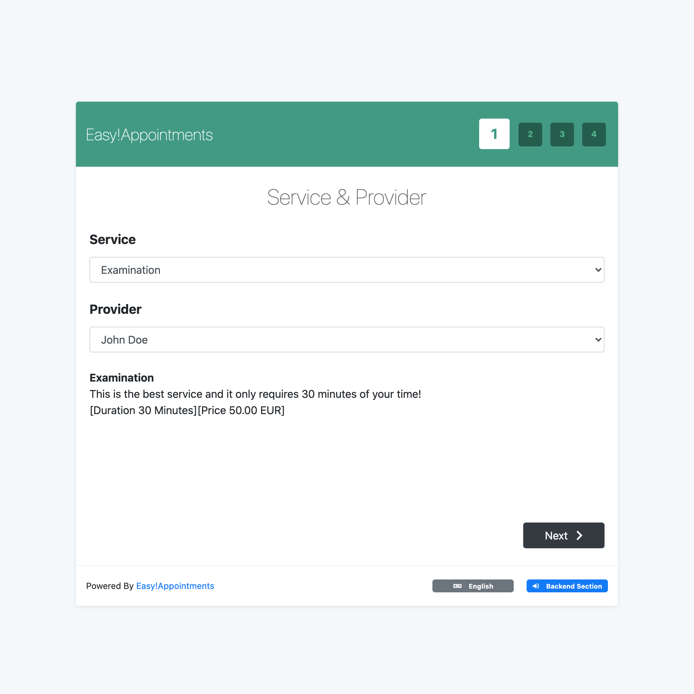

# EasyAppointments CI/CD pipeline

Deploy EasyAppointments with CI/CD on Elestio

 
 

# Once deployed ...

You can open EasyAppointments UI here:

    URL: https://[CI_CD_DOMAIN]

You can open PHPMyAdmin here:

    URL: https://[CI_CD_DOMAIN]:19566
    login: root
    password: [ADMIN_PASSWORD]
